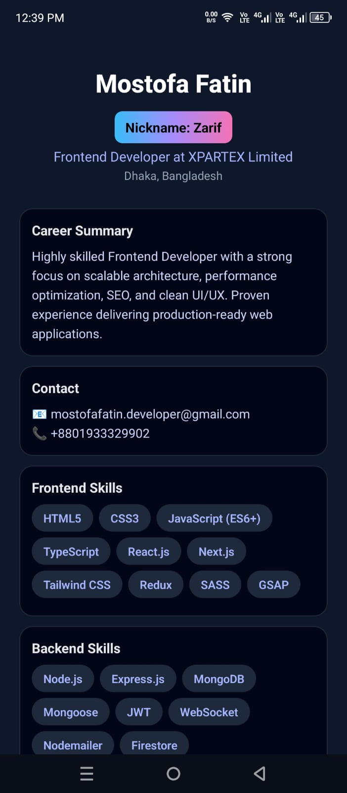

# react-native

 - Setup CI/CD through .github/workflows/.yml file
 - after learngin very basic things - went for deployment topics
 - why?= sometimes major task done by locally and there sometimes occur issues for deployment.

sample portfolio landing page

